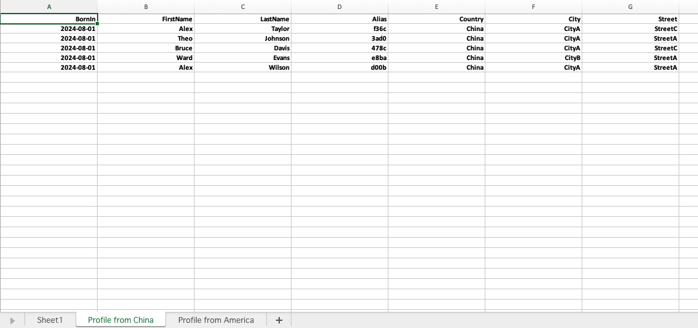
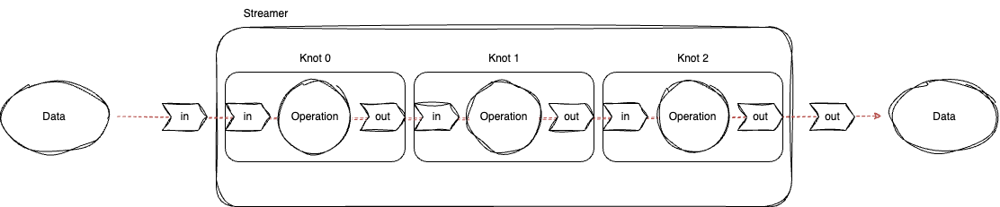

# ExcelStreamer

This package is based on package Excelize for writing data to Excel file, in all-stream style. This can be used to generate Excel files of which the struture is as simple as below, but the data scale is **very** large. 



# Introduction

This framework is consisted of two parts: Streamer, and Execel Writer.

## Streamer



A Streamer contains many Knots which are responsible for handling data, and a channel is used to connect adjacent two Knots. Specifically, if channel A connects Knot 1 and Knot 2, channel A is the output channel of Knot 1, and the input channel of Knot 2.

The Streamer should contain at least one input channel, or it cannnot start because no data will come in. However, since the point is the operation, the output maybe unnecessary, which means the Streamer can start without output channel.

## Excel Writer


To driver an Excel Writer, we need prepare two things: 

* The input raw data in **json string**
* Predefined configuration determining how to format the data and where to put them

For the configuration file, the keywords and the corresponsing influence are shown below:

* Sheets: Contains all the defined sheets.
* SheetName: The name of this sheet.
* Anchor: The anchor for data to be put in this sheet. The parser inside supports **and(&&)** operation and **or(||)** operation, and also recursive search.
* Hide: Whether this sheet will be shown.
* Fields: Contains all the fields in this sheet.
* Source: Determining from which the data within this field comes. The parser inside supports recursive search.
* Header: The header for this field, and is going to be shown in the first row.
* Width: The width of the col.
* Format: determining how to format the data. Currently only **TIMESTAMP** is supported, but you can register custom format function if you need.
* HeaderStyle: determining how the header is renderred. This is consistent with the Style from package Excelize.
* DataStyle: determining how the data is renderred. This is consistent with the Style from package Excelize.

# Installation

```shell
go get -u github.com/theo1893/excelstreamer
```

# Quick Start

You can follow the steps below to build an excel stream writer simplely.

## Step1

Create an ExcelStreamWriter instance.

```go
s, err := NewExcelStreamWriter("base_excel_path.xlsx", "configuration_file_path.yml", "dst_excel_path.xlsx")
if err != nil {
	panic(err)
}
```

## Step2

Create an input channel, add it into the ExcelStreamWriter, and then trigger the writer.

```go
inputCh := make(chan interface{})
s.AddInChan(inputCh)
s.Trigger()
```

## Step3

Put data into the the input channel, and listen to the status of writer. If there is something wrong while handling data, the writer will be aborted instantly.

```go
for _, rawData := range dataSource {
	select {
	// the streamer has been aborted for some reason
	case <-s.Aborted():
		log.Println(s.Error())
		close(inputCh)
		return
	case inputCh <- rawData:
	}
}
```

## Step4

After all the data has been sent to writer, you need close input channel to notify the writer that there is no more data, and then the writer will quit safely after finishing handling the remaining data.

```go
close(inputCh)

select {
case <-s.Aborted():
	log.Println(s.Error())
	return
}
```

# Performance

The metrics below are sampled with my laptop(Mac Book Air M3), and I believe the performace should be better if this runs on better machines.

Each row within tests consists of 19 columns, 12 of which are of type string, and the rest are of type int or float.

## Time

The consumed time grows linearly with the growing data number.

| Row Number | Time Consumed (s) |
| ---------- | ----------------- |
| 1,000      | 0.06              |
| 5,000      | 0.27              |
| 10,000     | 0.52              |
| 50,000     | 2.59              |
| 100,000    | 5.19              |
| 500,000    | 26.12             |
| 1,000,000  | 51.91             |

## Memory

Do not worry about this. Since there is no growing slice, map, or anything else, the consumed memory is constant no matter how much data you put.

| Row Number | RES from TOP(MB) |
| ---------- | ---------------- |
| 100,000    | ~98              |
| 500,000    | ~98              |
| 1,000,000  | ~98              |

# Q&A

## Why is here no ExcelStreamReader?

I think wrting is more difficult than reading since wrting involves styles,  so only ExcelStreamWriter is supported currently. If you need this function, you can make it by yourself with this package.

## Can this be used in CSV file?

Surely. Writing CSV files is simpler, and you can just change a little bit codes to achieve that.

